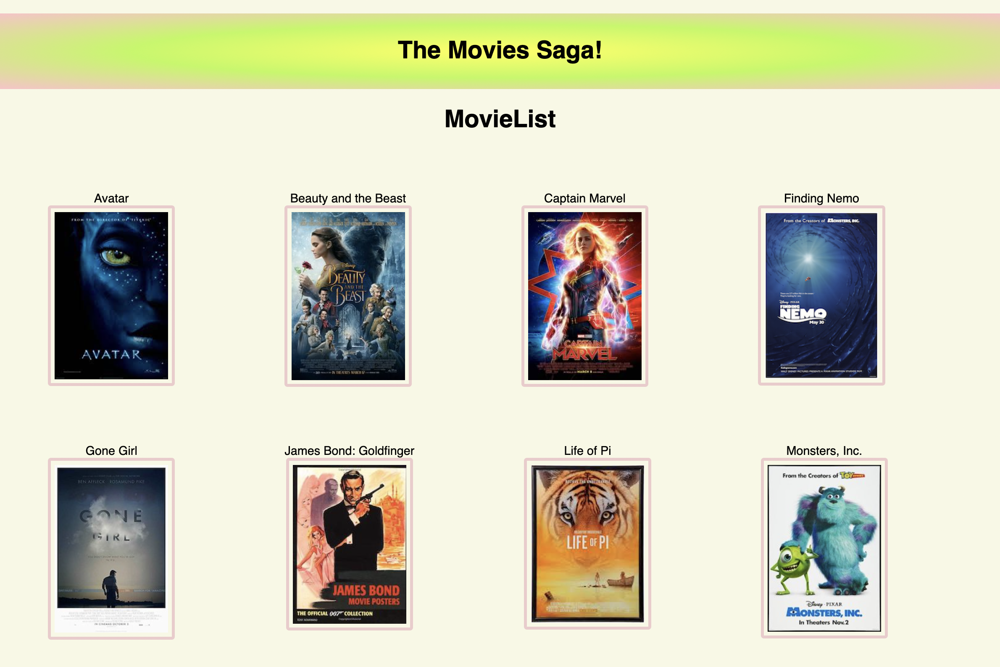
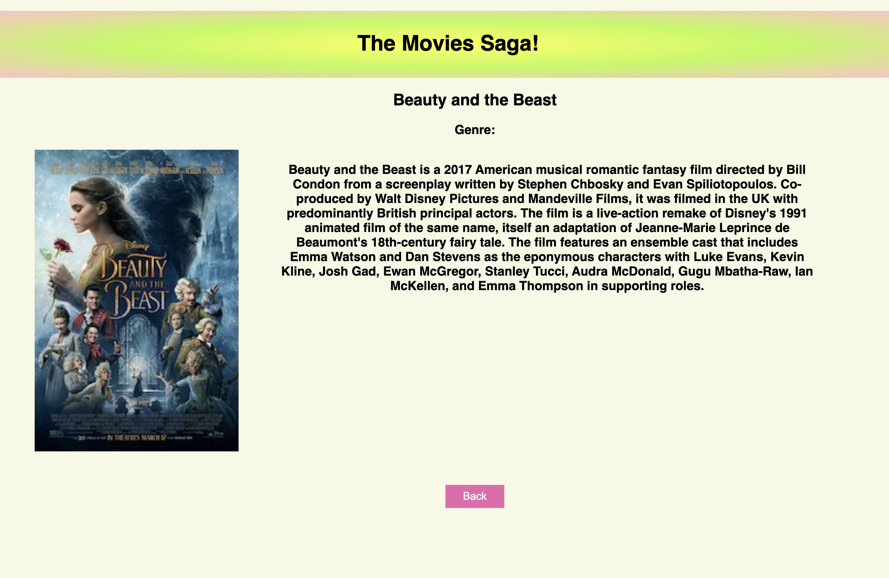

# Movie Gallery

## Description
Duration: 10 hours

Most codes and required imports were provided for us. What's left to do is show all related details of selected/clicked movie in another view.

## Installation
- HTML
- Javascript
- jQuery
- CSS
- PostSQL/Postico
- Visual Studio 

1. `npm install`
2. `npm run server`
3. `npm run client`

## Database Setup

1. Create a database named `saga_movies_weekend`
2. Run the queries from `database.sql` on the `saga_movies_weekend` database

###Terminals
Don't forget to:
    - npm install nodemon --global (if you don't have nodemon)
Have two terminal tabs:
    - npm install
    - npm run server
and
    - npm run client 

our client side and server side will automatically spin back up when changes are made!

### Screenshots

## Acknowledgement

Thanks to [Prime Digital Academy](www.primeacademy.io) who equipped and helped me to make this application a reality. Thanks to our insturctors - Liz and Dane for their guidance and dynamatic teaching skills. Last, but not least Thanks to all my classmates for their support and estatic attitude.

